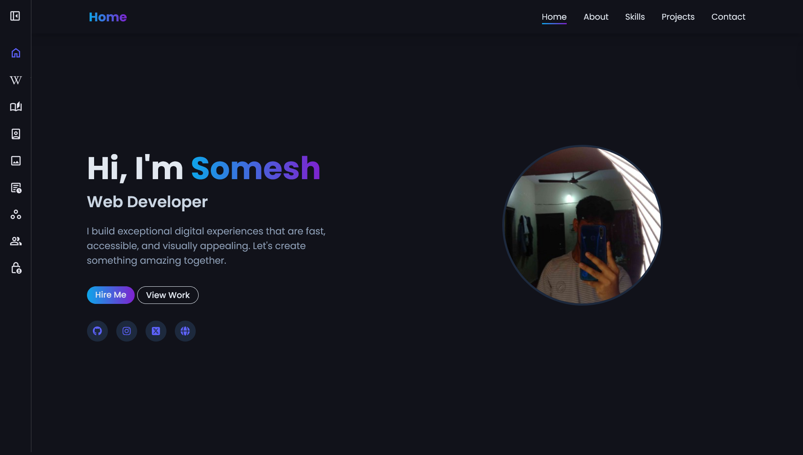
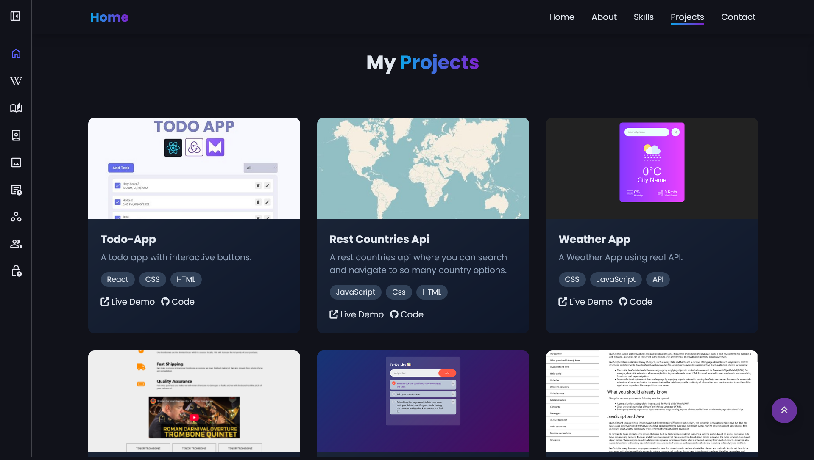
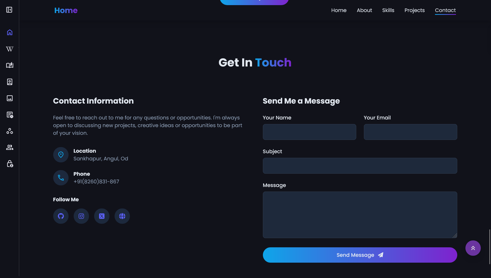
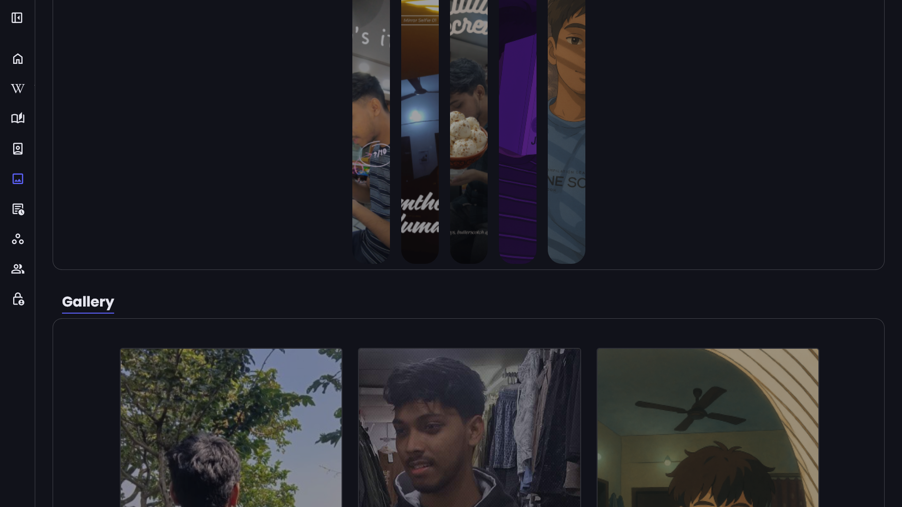
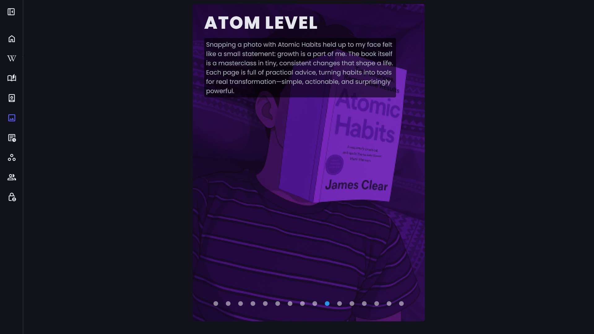
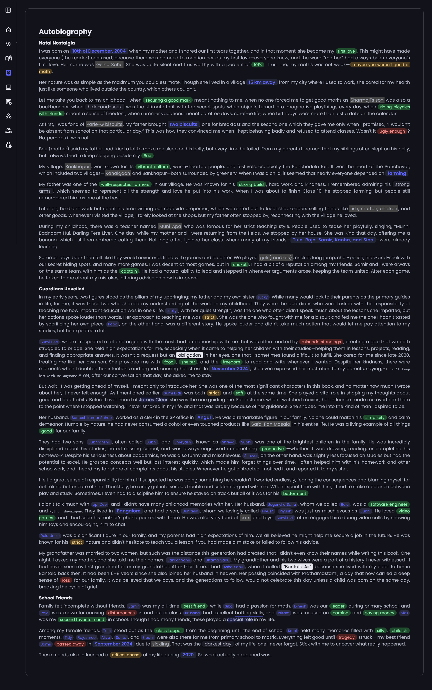

This is my first [Portfolio](./index.html) that is being updated since it was created. If i've not placed any warnings or notes that means i own and update this site at the time of you're reading this.

## Table of contents

- [Overview](#overview)

  - [The challenge](#the-challenge)
  - [Screenshot](#screenshots-and-recording)
  - [Links](#links)

- [Author](#author)
- [Acknowledgments](#acknowledgments)

---

## Overview

### The challenge

Users should be able to:

- view a portfolio page in the home.
- Navigate to various sections via the sidebar which will be availabe for mobiles as well.
- Know everything that's going on around me(journal page).
- Navigate to a Gallery sections where i'll be posting some of my photos.

### Screenshots and Recording
<!-- 
<video width="320" height="240" controls autoplay>
  <source src="./assets/screenshotsandvideos/videos/Desktop-Design.mp4">
  Your browser does not support the video tag.
</video>
<video width="320" height="240" controls autoplay>
  <source src="./assets/screenshotsandvideos/videos/Mobile-Design.mp4">
  Your browser does not support the video tag.
</video> -->

#### Desktop Design

### Links

- **Solution URL:** [https://github.com/somesh2hsl/](https://github.com/somesh2hsl/)
- **Live Site URL:** [https://ftsomesh.github.io/somesh2hsl/index.html]([https://ftsomesh.github.io/somesh2hsl/index.html)

---

## Author

- **Website:** [Somesh Sahu](https://ftsomesh.github.io/somesh2hsl)
- **Frontend Mentor:** [@ftsomeshh](https://www.frontendmentor.io/profile/ftsomeshh)
- **Twitter:** [@ftsomeshh](https://www.twitter.com/ftsomeshh)

---

## Acknowledgments

A big thanks to **Great Stack** for the challenge design.

---
